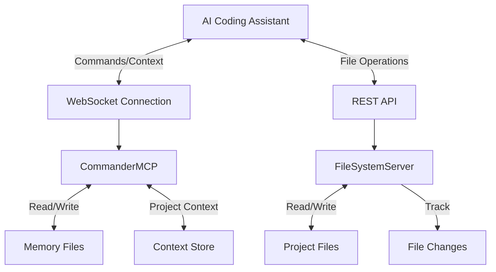

# Architecture

## Overview
The MCP (Master Control Program) Agent is designed to provide long-term memory and context for AI coding assistants. It consists of three main components:

1. **Memory System**: A collection of files in the `memory/` directory that store project metadata, architectural decisions, todos, and other context.
2. **FileSystemServer**: A REST API server that handles file operations and tracks changes to project files.
3. **CommanderMCP**: A WebSocket server that processes commands from AI assistants and provides project context.

## Components

### Memory System
- `project.json`: Project metadata and configuration
- `architecture.md`: System architecture documentation (this file)
- `decisions.md`: Log of architectural and design decisions
- `changelog.md`: Record of changes to the project
- `todos.md`: Active to-do list for the project

### FileSystemServer
- REST API for file operations
- File change tracking
- Memory file access

### CommanderMCP
- WebSocket interface for real-time commands
- Project context management
- Memory file manipulation

## Data Flow

## Communication Protocol

### WebSocket Commands
- `READ_MEMORY`: Read a memory file
- `WRITE_MEMORY`: Write to a memory file
- `GET_CONTEXT`: Get current project context
- `ADD_TO_CONTEXT`: Add information to project context
- `LOG_DECISION`: Log a design decision
- `UPDATE_TODO`: Update a todo item

### REST API Endpoints
- `GET /api/file`: Read a file
- `POST /api/file`: Write to a file
- `GET /api/memory`: Get all memory files
- `GET /api/changes`: Get file change history

## Memory Structure
The memory system is designed to provide persistent context across coding sessions:

1. **Project Information**: Basic metadata about the project
2. **Architectural Decisions**: Key design choices and their rationales
3. **Task Tracking**: Current and completed tasks
4. **Change History**: Record of modifications to the project

This structure allows AI assistants to maintain awareness of the project's state, history, and goals, even across multiple sessions. 